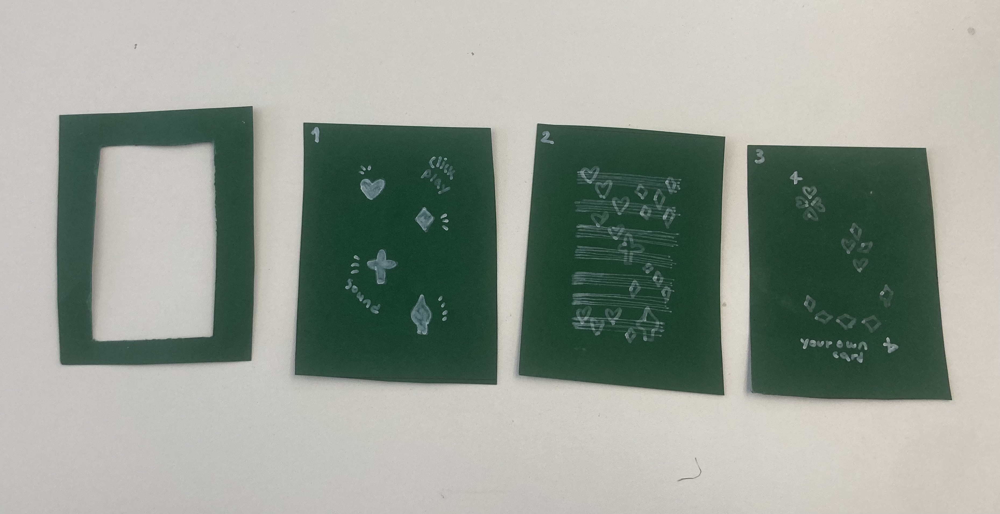

## Research 

### Paper prototype

 
 I don't have any specific idea to develop yet for the project and how these days lead me in a frastrated way. However, I'm doing something at least.

 
 I had a meeting with Daniel to go deep into interactivities.
 I could make some recognition of color, gesture, symbol and make some kits on MAX. There is a kit to look at it calling CV.jit

 ## Review 

 Monday morning, a lectruer from paris gave a very strong impact on these whole process. What she explained was that I was always doubt about a manchine running and generative AI, ever since I started this master. Probably, I need to figure out the critical/ problematic point about doing this process in this course. That's how I can be learning at the same time doing works.
However, I personnally didn't like the afternoon excercise on Monday. We had to select a card and explain onto it however, it didn't feel like connected to our project or morning presentation. I think there are more unique and exciting ways to make us inspired and review all the way we have been. Fortunately, I have people that I can share ideas and comments with and I'm looking forward to developping it ! 

!

