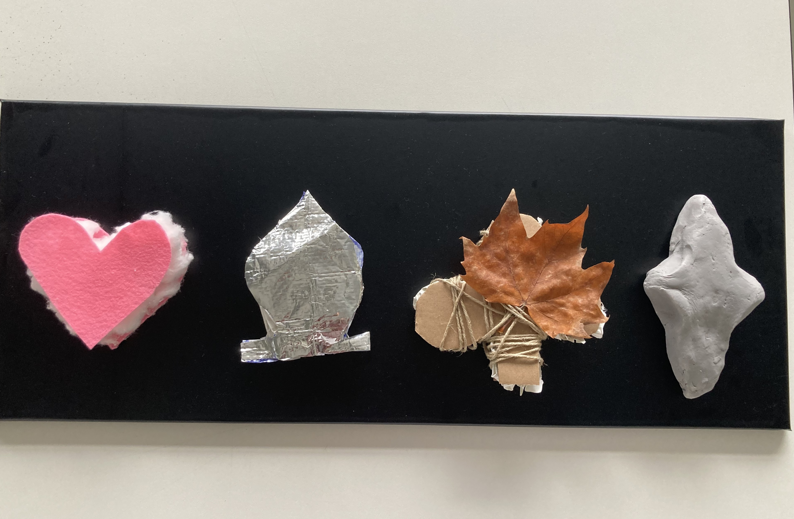

# Idea idea idea

RDV with an assisant in pool numérique

Ardurino potential meter
[Link1](https://www.google.com/search?client=safari&sca_esv=e91c68ae27c7b98c&rls=en&sxsrf=AE3TifNSBQHuDnqCn5g5J58zatQoUzKQRg:1759995633080&udm=2&fbs=AIIjpHxU7SXXniUZfeShr2fp4giZ1Y6MJ25_tmWITc7uy4KIeioyp3OhN11EY0n5qfq-zEMZldv_eRjZ2XLYc5GnVnMEIxC4WQfoNDH7FwchyAayyomVtyMIlwCjX48LT0TrXSNU5mLhW4DIlZIt3-gwG8mMeXC-Y0JFzx5GBuU59za0o5XLXRovSVas40d3y4gTUxobLZ8-C-h3aNfCXmcENPvCZqzMdA&q=potential+meter&sa=X&ved=2ahUKEwj6jpDUzpaQAxWUhv0HHbRMF5oQtKgLegQIGRAB&biw=1512&bih=864&dpr=2)

Makey makey (Simply to set up, touch something to trigger something with electricity)

Ardurino slider
[Link2](https://www.google.com/search?client=safari&sca_esv=e91c68ae27c7b98c&rls=en&sxsrf=AE3TifM5o4I6LU7SNsYRn2M4pETw9wv2tQ:1759995708949&udm=2&fbs=AIIjpHxU7SXXniUZfeShr2fp4giZ1Y6MJ25_tmWITc7uy4KIeioyp3OhN11EY0n5qfq-zEMZldv_eRjZ2XLYc5GnVnME7glWodDcaQwvGYJtospyF4GO5MC0p7Um53mJ2FnRmWzLfvs8MM15EI7IZ9K-WzjfyMSonUBkTYoaEYz_aoCWKu9TQ8dof5M0D_kBJ6KHVqAfl1pdvC4fEdvCuKBOfnDqAXG81w&q=arduino+slider&sa=X&ved=2ahUKEwjQ4qb4zpaQAxXVlP0HHYnxE7sQtKgLegQIFhAB&biw=1512&bih=864&dpr=2)

## Question
Do we want to use something to fix the objects on the plate? For example, slider xy (Zhanlan)

It can be a free form 

If we want a specific adjust with mouvement - sound, maybe it is the best to use a camera to catch the details. 

[Bela](https://www.google.com/search?client=safari&rls=en&q=bela+gem&ie=UTF-8&oe=UTF-8)

[Pure data](https://www.google.com/search?client=safari&rls=en&q=pure+data&ie=UTF-8&oe=UTF-8)

[Bela super collider](https://learn.bela.io/using-bela/languages/supercollider/)

## Confirmation concept
We want four different objects which have all different tactile on it. When you touch it and move it around there is a screen in front of it, which showes historical objects developements with years/ informations. 
Tactile is based on historical symbol developement ! 
Sound can be simply and very sensitive (well recognised connected with movement)

### Prototype

Heart Fluffy 
Spades Metalic 
Clubs Wood/ nature
Diamond Stone/ Ceramique

## RDV With w/ Alexia 
1. Make the tactile / Diffrent soundscape -Pitch? Component? Instrument? How?
2. Graphic looks like on the screen and at the same time to sound working (Explain in the prototype!)
3. Interface 
4. What do we want public to remember after playing this installation? What is our message through this work? (Important question)
5. Is it abut historical fact? Somthing about tactile? Playing sound? Focus on what?